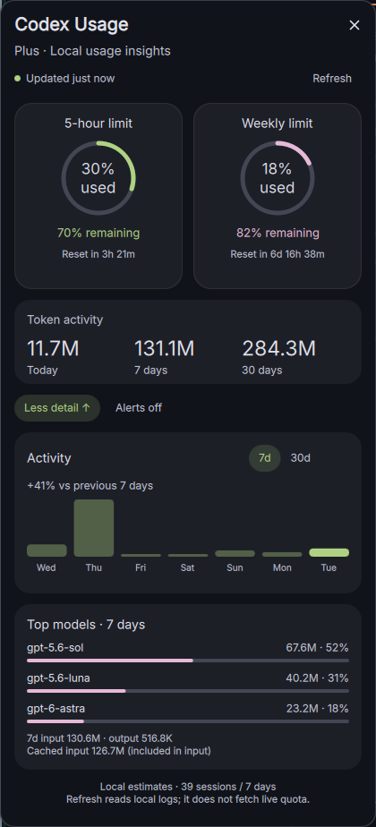

# Codex Usage for Dank Material Shell

Your Codex limits, one glance away.

A compact DankBar widget with two progress rings: **five-hour usage on top, weekly usage below**. Click for side-by-side quota cards, animated usage rings, reset countdowns, and local token activity.



## Features

- Two stacked progress rings for vertical bars; labeled percentages for horizontal bars.
- Side-by-side five-hour and weekly quota cards with explicit **used** labels and remaining percentages.
- Theme-aware colors, subtle card borders, and animated rings and charts.
- Reset countdowns, relative snapshot age, and a stale-data indicator.
- Local token totals for today, the last 7 days, and the last 30 days.
- Switchable **7d / 30d** activity chart; hover a bar for its date and exact token count.
- Seven-day activity compared with the previous seven days when that period has recorded tokens.
- Top four models over the last seven days, with token counts and percentage shares.
- Seven-day input, output, and cached-input breakdown when present in the logs.
- Expandable details, with the selected view and chart period saved between reloads.
- Optional **80% / 90%** quota alerts, off by default.
- Reads local Codex session logs every 30 seconds; a **Refresh** button rereads them immediately.
- No API calls, additional sign-in, or Python dependencies beyond the standard library.

## Requirements

- Dank Material Shell with plugin support.
- Python 3.9 or newer, available as `python3`.
- Codex CLI that records `token_count` rate-limit snapshots in its local session logs.
- A Codex session with recorded subscription quota information.

Tested on Hyprland. The widget uses DMS components; other compositors have not been tested.

## Install

```sh
git clone https://github.com/mir4zul/codex-usage.git ~/.config/DankMaterialShell/plugins/codexUsage
```

The directory name must be `codexUsage`. In DMS Settings → Plugins, enable **Codex Usage**, then add it to your DankBar widgets. Restart DMS if it does not discover the new plugin.

Registry submission is pending. Once accepted, search for **Codex Usage** in Settings → Plugins → Browse.

## Record your usage

If necessary, run `codex login` and finish the browser sign-in. Use Codex for a task so it records a quota snapshot. The widget will pick it up on its next refresh.

The top ring is the five-hour limit; the bottom ring is the weekly limit. Percentages show **used**, not remaining, quota.

## Dashboard controls

- **7d / 30d:** Change the activity chart period. Hover a bar to see its exact count above the chart. Model rankings and the token breakdown always cover seven days.
- **Less detail / More detail:** Collapse or expand the chart, model rankings, and token breakdown.
- **Alerts off / Alerts on:** Enable DMS warning toasts at 80% and 90% used quota. Each threshold is reported at most once per quota window, with alert history saved across reloads. Alerts use fresh local snapshots and skip expired windows; they are not background account monitoring.
- **Refresh:** Reread local logs. This does not request new usage data from the account.

## How it works and limitations

The helper reads `~/.codex/sessions/**/*.jsonl`, or `$CODEX_HOME/sessions` when `CODEX_HOME` is set in the DMS process environment. It selects the newest Codex quota snapshot and ignores separate premium-limit snapshots.

These are **last recorded values**, not a live account query. Usage from another device or an idle session will not appear until Codex records a new local snapshot. Snapshots older than 30 minutes are marked **Stale**. After a reset, old percentages remain with **Waiting for fresh data** until a fresh snapshot arrives. Check the update age before relying on a number. Countdown text is computed locally and refreshed every minute.

Token activity is a local estimate from positive cumulative-token deltas, including cached input tokens. Repeated unchanged totals add no tokens. Days use the system timezone; 7/30-day totals are rolling calendar-day windows. Forked or copied session histories can overlap, and missing logs cannot be counted. Cached input is a subset of input, not an additional amount to add to the total. Breakdowns depend on the fields recorded in the logs and can be unavailable or partial. These figures are not billing amounts or account-wide totals. Parsed per-file token aggregates are cached under `$XDG_CACHE_HOME/codexUsage` (normally `~/.cache/codexUsage`); no conversation text is cached.

This does not show general ChatGPT conversation usage. API-key sessions or Codex versions without compatible quota logs may show “No usage recorded”. The local log format can change between Codex versions.

The helper does not read authentication files, refresh tokens, contact a server, or upload session content. Each installation reads its own user's local logs.

## Troubleshooting

Run the helper directly:

```sh
python3 ~/.config/DankMaterialShell/plugins/codexUsage/get-codex-usage.py
```

`LOGGED_IN=false` means no compatible local quota snapshot was found; it is not a check of your current authentication status. Use Codex and check the log location. If DMS was started before setting `CODEX_HOME`, update its environment and restart it.

## Development

```sh
python3 -m unittest discover -s tests -v
```

The screenshot shows the real widget on Hyprland. Its usage values are an example snapshot, not values bundled into the plugin.

## Credits and license

MIT licensed. Adapted from Feiko Wielsma's Antigravity Usage plugin, itself based on Nicolas Bellamy's [Claude Code Usage plugin](https://github.com/titeya/dms-claudecode). Original copyright notices are preserved in [LICENSE](LICENSE).

Community plugin; not affiliated with or endorsed by OpenAI or the DMS maintainers.
